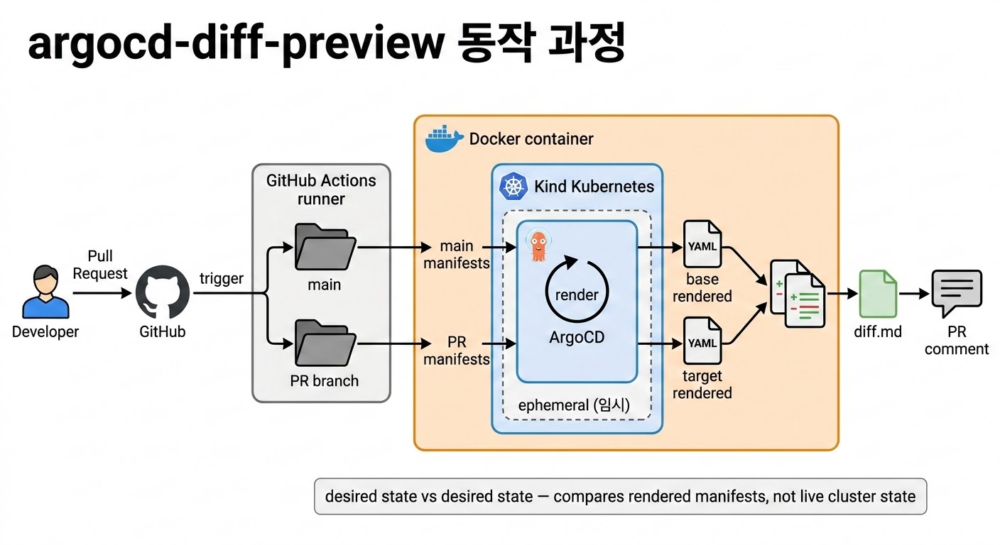

# argocd-diff-preview 동작 원리

## 요약

- argocd-diff-preview는 PR의 두 브랜치(base vs target)를 비교하여 **렌더링된 Kubernetes manifest diff**를 보여주는 도구입니다
- 내부적으로 **임시 Kind 클러스터를 생성**하고 ArgoCD를 Helm으로 설치한 뒤, 두 브랜치의 manifest를 각각 렌더링하여 diff를 생성합니다
- Terraform의 Atlantis와 비슷한 개념입니다. Helm/Kustomize 템플릿만으로는 실제 변경 사항을 파악하기 어렵기 때문에, **완전히 렌더링된 결과물**의 diff를 보여줍니다

## 핵심 개념

**desired state vs desired state 비교**입니다. 실제 클러스터의 live state와 비교하는 것이 아니라, base 브랜치와 target 브랜치의 desired state를 비교합니다. 같은 입력이면 항상 같은 결과가 나옵니다.

공식 문서 원문: *"uses a real Argo CD instance to render your manifests and compare the results between branches"*, *"the diff is 100% accurate"*



## 동작 과정

argocd-diff-preview는 총 12단계로 동작합니다. 이 12단계는 [공식 How it works 문서](https://dag-andersen.github.io/argocd-diff-preview/how-it-works/)에서 확인할 수 있습니다.

### Step 1-2: Application 탐색 및 필터링

base 브랜치와 target 브랜치 디렉터리에서 `kind: Application` 또는 `kind: ApplicationSet` YAML 파일을 찾습니다. label selector, file-path regex 등으로 필터링합니다.

### Step 3: Application 패치

찾은 Application을 임시 ArgoCD에서 동작하도록 패치합니다.

- `metadata.namespace`를 `argocd`로 설정
- `spec.syncPolicy`를 제거 (실제 sync 방지)
- `spec.project`를 `default`로 설정
- `spec.destination.server`를 `https://kubernetes.default.svc`로 설정
- `spec.source.targetRevision`을 해당 브랜치로 설정

### Step 4-5: 임시 클러스터 생성 및 ArgoCD 설치

**Kind 클러스터를 생성**하고 ArgoCD를 Helm chart로 설치합니다. CI 환경에서 Docker-in-Docker로 동작합니다.

### Step 6: 인증 정보 적용

private repo나 private registry 접근을 위한 Kubernetes Secret을 적용합니다.

### Step 7-8: ApplicationSet 확장 및 Application 등록

ApplicationSet이 있으면 `argocd appset generate` 명령어로 개별 Application으로 확장합니다. 패치된 Application을 `kubectl apply`로 등록합니다.

### Step 9-10: 렌더링 대기 및 manifest 추출

Application이 OutOfSync 상태가 될 때까지 대기합니다(기본 180초). OutOfSync가 되면 ArgoCD가 manifest 렌더링을 완료한 것입니다. `argocd app manifests` 명령어로 렌더링된 manifest를 추출합니다.

### Step 11-12: Diff 생성 및 출력

두 브랜치의 렌더링 결과를 비교하여 diff를 생성합니다. 결과물은 아래와 같습니다.

| 파일 | 설명 |
|------|------|
| `diff.md` | PR comment용 Markdown |
| `diff.html` | HTML side-by-side 비교 |
| `base-branch.yaml` | base 브랜치 전체 manifest |
| `target-branch.yaml` | target 브랜치 전체 manifest |

## 동작 흐름 요약

```text
PR 생성/업데이트
    │
    ▼
GitHub Actions 트리거
    │
    ▼
base/target 브랜치 checkout
    │
    ▼
argocd-diff-preview Docker 실행
    │
    ├── Kind 클러스터 생성
    ├── ArgoCD Helm 설치
    ├── Application 패치 및 등록
    ├── manifest 렌더링 대기
    ├── base/target manifest 추출
    └── diff 생성
    │
    ▼
gh pr comment로 diff.md 게시
```

## 두 가지 운영 모드

| 모드 | 설명 | 소요 시간 | 사용 시점 |
|------|------|-----------|-----------|
| Ephemeral Cluster (기본) | 임시 Kind 클러스터 생성 후 삭제 | 60-90초 | 처음 시작할 때, 완전한 격리가 필요할 때 |
| Pre-installed ArgoCD | 기존 ArgoCD 클러스터에 연결 | 10초 미만 | 속도 최적화, 전용 diff ArgoCD 인스턴스 운영 시 |

## 세 가지 렌더링 방법

| 방법 | 설명 | 특징 |
|------|------|------|
| `cli` (기본) | `argocd app manifests` CLI 사용 | 가장 안정적 |
| `server-api` | ArgoCD API server에 직접 gRPC 호출 | 더 빠름 |
| `repo-server-api` (실험적) | repo-server에 직접 gRPC 호출 | 가장 빠르지만 실험적 |

## 이 문서의 근거

이 문서의 동작 원리 설명은 아래 공식 문서를 기반으로 작성했습니다.

**12단계 동작 과정** — [How it works](https://dag-andersen.github.io/argocd-diff-preview/how-it-works/) 페이지에 Step 1~12가 명시되어 있습니다. 각 단계의 공식 설명은 아래와 같습니다.

| Step | 공식 문서 원문 |
| --- | --- |
| 1 | *"Collects all YAML resources containing kind: Application or kind: ApplicationSet from base and target branches"* |
| 2 | *"Filters applications using watch patterns, ignore annotations, label selectors, or file path regex to avoid unnecessary rendering"* |
| 3 | *"Modifies applications to set correct namespace, remove sync policies, target the local cluster, and point to the appropriate branch revision"* |
| 4 | *"Creates ephemeral Kubernetes cluster (ephemeral mode only)"* |
| 5 | *"Deploys Argo CD via official Helm Chart to the local cluster"* |
| 6 | *"Mounts repository and registry credentials from /secrets folder"* |
| 7 | *"Uses argocd appset generate to expand ApplicationSets into individual applications"* |
| 8 | *"Deploys patched applications to cluster; Argo CD begins rendering"* |
| 9 | *"Polls applications until ready (default 180-second timeout)"* |
| 10 | *"Uses argocd app manifests to retrieve fully-rendered YAML"* |
| 11 | *"Compares manifest sets, identifying added, removed, modified, and unchanged applications"* |
| 12 | *"Writes markdown, HTML, and individual YAML files to output folder"* |

**렌더링 범위** — [Application Selection](https://dag-andersen.github.io/argocd-diff-preview/application-selection/) 페이지 원문:

- 기본 동작: *"renders all applications it finds"*
- `--auto-detect-files-changed=true`: *"automatically determines which files changed in the pull request and match them against the watch-patterns"*
- 자기 자신 변경 시: *"Applications are always rendered if their own manifest file changes"*

**두 가지 운영 모드** — README 원문: *"spinning up an ephemeral cluster (or connecting to a pre-configured cluster) in your automated pipelines"*

## 참고자료

- <https://github.com/dag-andersen/argocd-diff-preview>
- <https://dag-andersen.github.io/argocd-diff-preview/how-it-works/>
- <https://dag-andersen.github.io/argocd-diff-preview/application-selection/>
