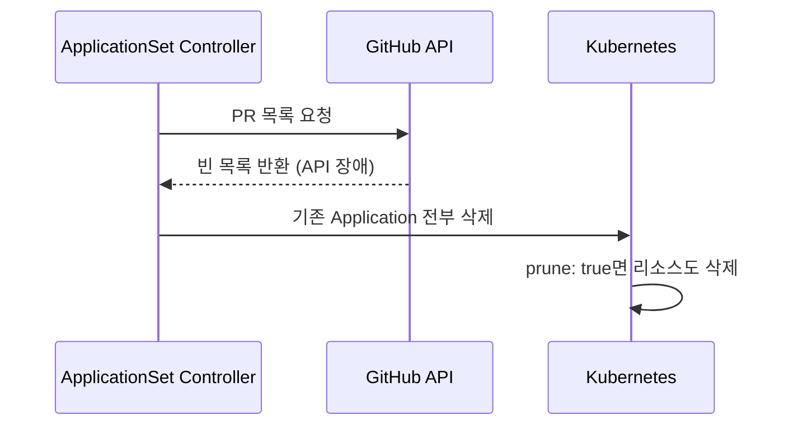

# Pull Request Generator 한계와 주의사항

## 요약

* Pull Request Generator는 외부 Git API에 의존하기 때문에, **API 장애 시 Application이 의도치 않게 삭제될 위험**이 있습니다.
* 이 문서에서는 PR Generator의 한계와 방어 방법을 설명합니다.

## 목차

* [네트워크 아키텍처](#네트워크-아키텍처)
* [Application 삭제 위험](#application-삭제-위험)
* [위험한 설정 예제](#위험한-설정-예제)
* [GitHub API 의존성](#github-api-의존성)
* [Token 관리 한계](#token-관리-한계)
* [Polling 방식의 한계](#polling-방식의-한계)
* [방어 방법](#방어-방법)
* [참고자료](#참고자료)

## 네트워크 아키텍처

Pull Request Generator는 **Webhook이 아닌 Polling 방식**입니다. ApplicationSet Controller가 GitHub API에 주기적으로 PR 목록을 요청합니다.

```
ArgoCD Cluster ---(outbound HTTPS)--→ GitHub API (api.github.com:443)
```

네트워크 흐름의 핵심 포인트입니다.

* **Outbound only**: ArgoCD가 GitHub에 요청합니다. GitHub → ArgoCD 방향의 inbound 연결은 없습니다.
* **방화벽 설정**: ArgoCD 클러스터에서 `api.github.com:443`으로의 outbound HTTPS만 허용하면 됩니다.
* **Webhook 아님**: GitHub에서 ArgoCD로 이벤트를 push하지 않으므로, ArgoCD의 ingress 설정이 필요 없습니다.
* **Polling 주기**: `requeueAfterSeconds` 값에 따라 주기적으로 GitHub API를 호출합니다.

## Application 삭제 위험

Pull Request Generator의 가장 큰 위험은 **오작동으로 인한 Application 대량 삭제**입니다.

PR Generator는 매 polling 주기마다 GitHub API에서 PR 목록을 가져옵니다. 가져온 PR 목록을 기반으로 Application을 생성하거나 삭제합니다. 문제는 **API가 빈 목록을 반환하면 기존 Application이 전부 삭제**된다는 점입니다.

삭제가 발생하는 시나리오입니다.

1. GitHub API가 장애로 빈 응답을 반환합니다.
2. ApplicationSet Controller가 "PR이 0개"로 해석합니다.
3. 기존에 생성된 모든 Application을 삭제합니다.
4. `syncPolicy.automated.prune: true`가 설정되어 있으면 Kubernetes 리소스까지 함께 삭제됩니다.



## 위험한 설정 예제

위험한 설정 예제는 [manifests/dangerous/](../manifests/dangerous/) 디렉터리에 있습니다. **학습 목적으로만 참고하고, 프로덕션 환경에 배포하지 마세요.**

### Label 필터 없는 설정 (no-label-filter.yaml)

`labels` 필터를 설정하지 않으면 **모든 PR이 Application을 생성**합니다. PR이 많은 저장소에서는 Application이 폭증하여 클러스터 리소스가 고갈될 수 있습니다. API 장애 시 대량의 Application이 동시에 삭제됩니다.

### preserveResourcesOnDeletion 없이 짧은 polling (no-preserve-resources.yaml)

`preserveResourcesOnDeletion`이 없고 polling 주기가 30초로 짧은 설정입니다. API 장애가 발생하면 30초 후 Application이 삭제되고, `prune: true` 설정으로 인해 Kubernetes 리소스까지 함께 삭제됩니다.

### 최악의 설정 (worst-case.yaml)

모든 위험 요소가 결합된 설정입니다.

* Label 필터 없음 → 모든 PR이 Application 생성
* `requeueAfterSeconds: 10` → 10초마다 GitHub API 호출 (Rate Limit 위험)
* `prune: true` → Application 삭제 시 K8s 리소스도 삭제
* `preserveResourcesOnDeletion` 없음 → 방어 장치 없음

API 장애 발생 시 10초 만에 모든 Application과 Kubernetes 리소스가 삭제됩니다.

## GitHub API 의존성

Pull Request Generator는 GitHub API에 강하게 의존합니다. 다음 상황에서 문제가 발생할 수 있습니다.

| 상황 | 영향 |
|---|---|
| GitHub API 장애 | PR 목록을 가져올 수 없어 Application 삭제 위험 |
| GitHub API Rate Limiting | 시간당 요청 수 초과 시 API 호출 실패 |
| 네트워크 장애 | API 서버에 연결할 수 없어 빈 응답 처리 가능 |

GitHub API Rate Limit은 인증된 요청 기준 **시간당 5,000회**입니다. PR이 많거나 polling 주기가 짧으면 Rate Limit에 도달할 수 있습니다.

## Token 관리 한계

GitHub Personal Access Token(PAT)과 관련된 한계입니다.

* **Token 만료**: PAT에 만료 기간이 설정되어 있으면, 만료 후 API 호출이 실패합니다. Token이 만료되었는지 모니터링할 별도 수단이 없습니다.
* **Token 권한 변경**: GitHub에서 Token 권한을 축소하면 API 호출이 실패할 수 있습니다.
* **Token 유출 위험**: Secret으로 관리하더라도 RBAC 설정이 미흡하면 Token이 노출될 수 있습니다.

## Polling 방식의 한계

Pull Request Generator는 Webhook이 아닌 **Polling 방식**으로 PR 목록을 확인합니다.

* **반영 지연**: 기본 polling 주기는 30분입니다. PR을 생성해도 최대 30분까지 Application 생성이 지연될 수 있습니다. `requeueAfterSeconds`로 주기를 줄일 수 있지만, API Rate Limit 위험이 증가합니다.
* **실시간 반영 불가**: PR 생성/삭제가 즉시 반영되지 않으므로, 긴급한 preview 환경이 필요한 경우 부적합합니다.

## 방어 방법

Application 삭제 위험을 줄이기 위한 방어 방법입니다.

### preserveResourcesOnDeletion

ApplicationSet에 `preserveResourcesOnDeletion: true`를 설정하면, Application이 삭제되어도 실제 Kubernetes 리소스는 보존됩니다.

```yaml
apiVersion: argoproj.io/v1alpha1
kind: ApplicationSet
metadata:
  name: pr-generator-example
  namespace: argocd
spec:
  syncPolicy:
    preserveResourcesOnDeletion: true
  generators:
    - pullRequest:
        # ...
```

### ApplicationSet Policy

ApplicationSet의 `strategy` 필드로 삭제 동작을 제어할 수 있습니다.

```yaml
spec:
  strategy:
    type: create-update
```

| Policy | 생성 | 수정 | 삭제 |
|---|---|---|---|
| `sync` (기본값) | O | O | O |
| `create-only` | O | X | X |
| `create-update` | O | O | X |
| `create-delete` | O | X | O |

`create-update`를 사용하면 Application 삭제를 방지할 수 있습니다. 단, PR이 닫혀도 Application이 남아있으므로 수동 정리가 필요합니다.

### Application Finalizer 제거

Application에서 finalizer를 제거하면, Application이 삭제되어도 Kubernetes 리소스는 남아있습니다. 하지만 이 방법은 정상적인 삭제 흐름도 방해하므로 권장하지 않습니다.

## 참고자료

* <https://argo-cd.readthedocs.io/en/stable/operator-manual/applicationset/Controlling-Resource-Modification/>
* <https://argo-cd.readthedocs.io/en/stable/operator-manual/applicationset/Generators-Pull-Request/>
