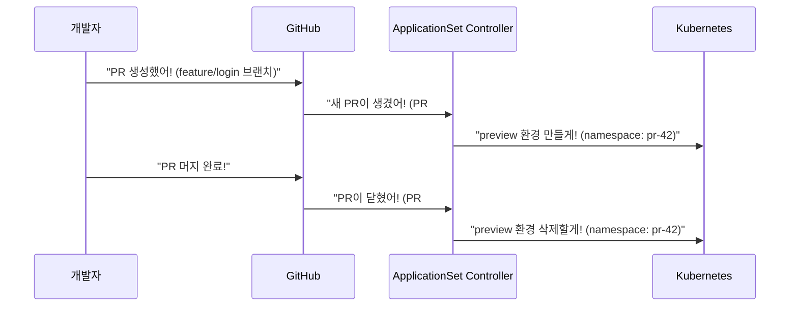

# Pull Request Generator란?

## 요약

* Pull Request Generator는 **Git 저장소의 PR(Pull Request)을 기반으로 ArgoCD Application을 자동 생성하는 Generator**입니다.
* PR이 생성되면 preview 환경을 자동으로 만들고, PR이 닫히면 환경을 자동으로 삭제합니다.
* GitHub, GitLab, Bitbucket 등 주요 Git 호스팅 서비스를 지원합니다.

## 목차

* [Pull Request Generator 정의](#pull-request-generator-정의)
* [왜 Pull Request Generator가 필요할까?](#왜-pull-request-generator가-필요할까)
* [지원하는 Git 호스팅 서비스](#지원하는-git-호스팅-서비스)
* [제공하는 파라미터](#제공하는-파라미터)
* [참고자료](#참고자료)

## Pull Request Generator 정의

Pull Request Generator는 ApplicationSet Generator 중 하나입니다. 이름을 분해하면 의미가 명확해집니다.

1. Pull Request: Git 저장소에서 코드 변경을 요청하는 기능입니다.
2. Generator: ApplicationSet에서 파라미터를 생성하는 역할입니다.
3. Pull Request Generator: **PR 정보(브랜치 이름, PR 번호 등)를 파라미터로 변환하여 Application을 자동 생성하는 Generator**입니다.

## 왜 Pull Request Generator가 필요할까?

개발 팀에서 PR을 생성할 때마다 preview 환경을 수동으로 만드는 것은 번거롭습니다.

일반적인 흐름은 다음과 같습니다.

1. 개발자가 feature 브랜치에서 PR을 생성합니다.
2. 리뷰어가 코드를 확인하기 전에 실제 동작을 확인하고 싶습니다.
3. 수동으로 preview 환경을 만들어야 합니다.
4. 리뷰가 끝나면 preview 환경을 수동으로 삭제해야 합니다.

**Pull Request Generator를 사용하면 PR 생성/삭제에 따라 preview 환경이 자동으로 생성/삭제됩니다.**

## 지원하는 Git 호스팅 서비스

Pull Request Generator는 여러 Git 호스팅 서비스를 지원합니다.

| 서비스 | 필드 이름 | 인증 방식 |
|---|---|---|
| GitHub | `github` | GitHub App 또는 Personal Access Token |
| GitLab | `gitlab` | Personal Access Token |
| Bitbucket Server | `bitbucketServer` | Basic Auth |
| Bitbucket Cloud | `bitbucket` | App Password |
| Gitea | `gitea` | Access Token |

## 제공하는 파라미터

Pull Request Generator는 PR 정보를 파라미터로 제공합니다. Template에서 이 파라미터를 사용할 수 있습니다.

| 파라미터 | 설명 | 예시 |
|---|---|---|
| `number` | PR 번호 | `42` |
| `branch` | PR의 source 브랜치 이름 | `feature/login` |
| `branch_slug` | 브랜치 이름을 URL-safe하게 변환 | `feature-login` |
| `target_branch` | PR의 target 브랜치 이름 | `main` |
| `target_branch_slug` | target 브랜치를 URL-safe하게 변환 | `main` |
| `head_sha` | PR의 최신 커밋 SHA | `abc123def` |
| `head_short_sha` | 커밋 SHA의 앞 7자리 | `abc123d` |
| `labels` | PR에 붙은 라벨 목록 | `bug,enhancement` |

이 파라미터를 Template에서 활용하는 방법은 [설정 방법](./configuration.md)을 참고하세요.

## 참고자료

* <https://argo-cd.readthedocs.io/en/stable/operator-manual/applicationset/Generators-Pull-Request/>
* <https://argo-cd.readthedocs.io/en/stable/operator-manual/applicationset/>
