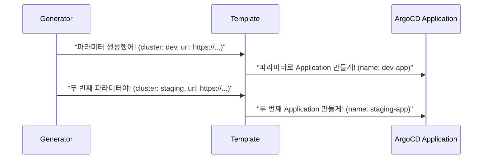

# Template 구조

## 요약

* Template은 **Generator가 생성한 파라미터를 받아서 ArgoCD Application을 만드는 틀**입니다.
* Go template 문법(`{{ }}`)을 사용하여 파라미터 값을 치환합니다.
* Template 구조는 ArgoCD Application spec과 동일합니다.

## 목차

* [Template이란?](#template이란)
* [Template 구조](#template-구조)
* [파라미터 치환](#파라미터-치환)
* [Template과 Generator 관계](#template과-generator-관계)
* [주의사항](#주의사항)
* [참고자료](#참고자료)

## Template이란?

Template은 Generator와 함께 ApplicationSet의 핵심 구성요소입니다. **Generator가 "무엇을" 만들지 결정한다면, Template은 "어떻게" 만들지 정의합니다.**

Template은 ArgoCD Application의 spec과 동일한 구조를 가집니다. 다만, 고정값 대신 Generator에서 전달받은 파라미터를 사용할 수 있습니다.

## Template 구조

Template의 기본 구조는 다음과 같습니다.

```yaml
spec:
  generators:
    - list:
        elements:
          - cluster: dev
            url: https://dev-cluster.example.com
  template:
    metadata:
      name: '{{cluster}}-app'
    spec:
      project: default
      source:
        repoURL: https://github.com/example/repo.git
        targetRevision: HEAD
        path: 'envs/{{cluster}}'
      destination:
        server: '{{url}}'
        namespace: default
```

Template 안에서 `{{cluster}}`와 `{{url}}`은 Generator가 생성한 파라미터입니다.

## 파라미터 치환

Generator가 생성한 파라미터는 `{{ }}` 문법으로 Template에 주입됩니다.

예를 들어, List Generator가 다음 파라미터를 생성했다면:

```yaml
- cluster: dev
  url: https://dev-cluster.example.com
```

Template의 `{{cluster}}`는 `dev`로, `{{url}}`은 `https://dev-cluster.example.com`으로 치환됩니다.

정리하면, **파라미터 이름과 Template의 변수 이름이 일치해야 정상적으로 치환됩니다.**

## Template과 Generator 관계



Generator가 파라미터를 N개 생성하면, Template은 N번 실행되어 N개의 Application을 만듭니다.

## 주의사항

Template을 작성할 때 헷갈리면 안되는 점이 있습니다.

1. **파라미터 이름 일치**: Generator에서 정의한 파라미터 이름과 Template에서 사용하는 변수 이름이 일치해야 합니다. 이름이 다르면 빈 값으로 치환됩니다.
2. **Application 이름 고유성**: Template에서 생성하는 Application 이름은 고유해야 합니다. 파라미터를 활용하여 이름이 겹치지 않도록 주의하세요.
3. **destination 설정**: `destination.server` 또는 `destination.name` 중 하나만 사용해야 합니다. 둘 다 설정하면 오류가 발생합니다.

## 참고자료

* <https://argo-cd.readthedocs.io/en/stable/operator-manual/applicationset/Template/>
* <https://argo-cd.readthedocs.io/en/stable/operator-manual/applicationset/GoTemplate/>
