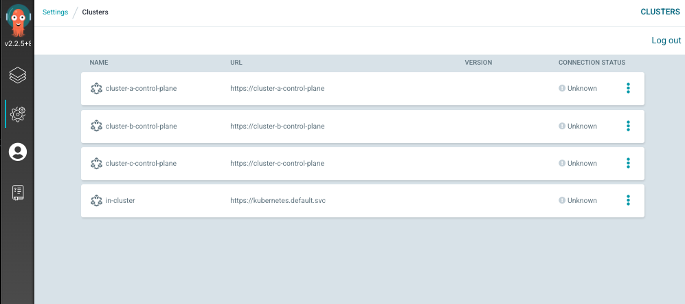

- [개요](#%EA%B0%9C%EC%9A%94)
- [AS-IS kind클러스터와 ArgoCD 생성](#as-is-kind%ED%81%B4%EB%9F%AC%EC%8A%A4%ED%84%B0%EC%99%80-argocd-%EC%83%9D%EC%84%B1)
- [ArgoCD에 A,B,C kind 클러스터 등록](#argocd%EC%97%90-abc-kind-%ED%81%B4%EB%9F%AC%EC%8A%A4%ED%84%B0-%EB%93%B1%EB%A1%9D)
- [ArgoCD Project 생성](#argocd-project-%EC%83%9D%EC%84%B1)
- [Argocd Application 생성](#argocd-application-%EC%83%9D%EC%84%B1)
- [마이그레이션](#%EB%A7%88%EC%9D%B4%EA%B7%B8%EB%A0%88%EC%9D%B4%EC%85%98)
  - [옵션1 6.1 수작으로 진행](#%EC%98%B5%EC%85%981-61-%EC%88%98%EC%9E%91%EC%9C%BC%EB%A1%9C-%EC%A7%84%ED%96%89)
  - [옵션2 ArgoCD export, import기능 사용](#%EC%98%B5%EC%85%982-argocd-export-import%EA%B8%B0%EB%8A%A5-%EC%82%AC%EC%9A%A9)

# 1. 개요
* 멀티 클러스터를 관리하는 ArgoCD를 마이그레이션하는 방법을 정리


# 2. AS-IS kind클러스터와 ArgoCD 생성

* AS-IS kind클러스터와 A,B,C kind클러스터 3대가 생성
* AS-IS kind 클러스터에는 ArgoCD helm chart가 릴리즈 되어 있음

```sh
1. cd terraform
2. terrafprm apply
```

# 3. ArgoCD에 A,B,C kind 클러스터 등록

* 2번과정에서 terraform으로 kind cluster가 생성되어야 있어야 합니다.

```sh
1. cd argocd_clusters

2. pip install chevron

3. python create_kubernetes_secrets

# helm values 생성하는 스크립트(전제조건, A,B,C kind kubeconfig가 생성되어 있어야 함)
4. kubernetes secrest를 apply
KUBECONFIG=../terraform/as-is-config kubectl apply -f kind-cluster-a-secrets.yaml
KUBECONFIG=../terraform/as-is-config kubectl apply -f kind-cluster-b-secrets.yaml
KUBECONFIG=../terraform/as-is-config kubectl apply -f kind-cluster-c-secrets.yaml
```


# 4. ArgoCD Project 생성

```sh
1. cd argocd_projects

2. kubernetes apply
KUBECONFIG=../terraform/as-is-config kubectl apply -f ./cluster_A/
KUBECONFIG=../terraform/as-is-config kubectl apply -f ./cluster_B/
KUBECONFIG=../terraform/as-is-config kubectl apply -f ./cluster_C/
```




# 5. Argocd Application 생성

```sh
1. cd argocd_applications

2. kubernetes apply
KUBECONFIG=../terraform/as-is-config kubectl apply -f ./cluster_A/
KUBECONFIG=../terraform/as-is-config kubectl apply -f ./cluster_B/
KUBECONFIG=../terraform/as-is-config kubectl apply -f ./cluster_C/
```


# 6. 마이그레이션

## (옵션1) 6.1 수동
1. AS-IS와 같은 설정으로 TO-BE ArgoCD 생성
2. AS-IS ArgoCD Cluster를 그대로 TO-BE ArgoCD에 생성
3. AS-IS ArgoCD Project를 그대로 TO-BE ArgoCD에 생성
4. AS-IS ArgoCD Application을 그대로 TO-BE ArgoCD에 생성

* AS-IS ArgoCD Default project를 제외하고 ArgoCD application 추출

```sh
KUBECONFIG=./as-is-config kubectl get applications -n argocd -o yaml | yq e 'del(.items[].metadata.resourceVersion, .items[].metadata.uid, .items[].metadata.creationTimestamp, .items[].metadata.annotations, .items[].metadata.generation, .items[].status) | .items |= map(select(.spec.project != "default"))' > as-is-application.yaml
```

* TO-BE ArgoCD에 배포

```sh
KUBECONFIG=./to-be-config kubectl apply -f as-is-application.yaml
```

## (옵션2) ArgoCD export, import기능 사용

```sh
argocd admin export > export.yaml
argocd admin import ...
```
