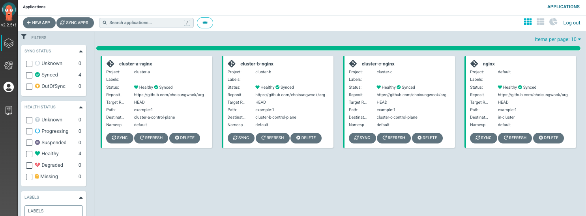

# 개요
* ArgoCD에 ArgoCD Application 생성

# 전제조건
* [테스트 환경 구축](../terraform/)이 되어 있어야 함
* [ArgoCD Project](../argocd_projects/)가 생성되어 있어야 함

# 생성 방법

```sh
KUBECONFIG=../terraform/as-is-config kubectl apply -f ./as-is
KUBECONFIG=../terraform/as-is-config kubectl apply -f ./cluster_A/
KUBECONFIG=../terraform/as-is-config kubectl apply -f ./cluster_B/
KUBECONFIG=../terraform/as-is-config kubectl apply -f ./cluster_C/
```


