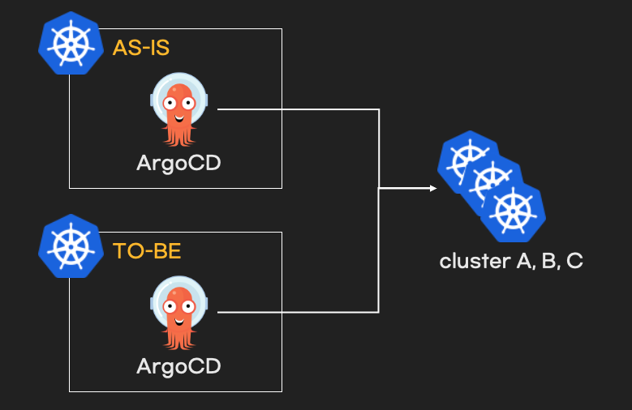

# 개요
* terraform으로 ArgoCD migration 테스트 환경 구성

# 아키텍처



# 실행방법

* terraform 배포

```sh
terraform init
terraform apply
```

* kubeconfig 확인

```sh
$ ls -l *-config
-rw-------  1 test  test  5600 May 12 00:21 as-is-config
-rw-------  1 test  test  5604 May 11 23:42 to-be-config

* kubectl 사용 방법

```sh
# AS-IS kind cluster
KUBECONFIG=as-is-config kubectl get nodes
KUBECONFIG=as-is-config kubectl get pod -n argocd

# TO-BE kind cluster
KUBECONFIG=to-be-config kubectl get nodes
```

# ArgoCD 설치 확인

```sh
# AS-IS kind cluster
KUBECONFIG=as-is-config kubectl get pod -n argocd

# TO-BE kind cluster
KUBECONFIG=to-be-config kubectl get pod -n argocd
```

# ArgoCD 접속 방법

* AS-IS: https://127.0.0.1:30950
* TO-BE: https://127.0.0.1:30960

# ArgoCD 초기 비밀번호

```sh
# AS-IS kind cluster
PASSWORD=$(KUBECONFIG=as-is-config kubectl -n argocd get secret argocd-initial-admin-secret -o jsonpath="{.data.password}")
echo $PASSWORD | base64 -d; echo

# TO-BE kind cluster
KUBECONFIG=to-be-config kubectl -n argocd get secret argocd-initial-admin-secret -o jsonpath="{.data.password}" | base64 -d; echo
echo $PASSWORD | base64 -d; echo
```

# 삭제 방법

```sh
terraform destroy
```
