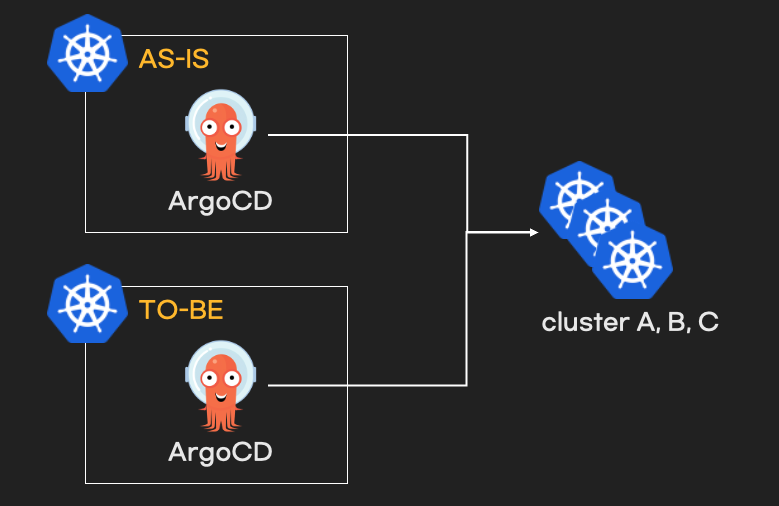

- [개요](#%EA%B0%9C%EC%9A%94)
- [전제조건](#%EC%A0%84%EC%A0%9C%EC%A1%B0%EA%B1%B4)
- [아키텍처](#%EC%95%84%ED%82%A4%ED%85%8D%EC%B2%98)
- [실행방법](#%EC%8B%A4%ED%96%89%EB%B0%A9%EB%B2%95)
- [ArgoCD 설치 확인](#argocd-%EC%84%A4%EC%B9%98-%ED%99%95%EC%9D%B8)
- [ArgoCD 접속 방법](#argocd-%EC%A0%91%EC%86%8D-%EB%B0%A9%EB%B2%95)
- [ArgoCD 초기 비밀번호](#argocd-%EC%B4%88%EA%B8%B0-%EB%B9%84%EB%B0%80%EB%B2%88%ED%98%B8)
- [삭제 방법](#%EC%82%AD%EC%A0%9C-%EB%B0%A9%EB%B2%95)
- [다음 단계](#%EB%8B%A4%EC%9D%8C-%EB%8B%A8%EA%B3%84)

# 개요
* terraform으로 ArgoCD migration 테스트 환경 구성
* kubernetes는 kind cluster를 사용

# 전제조건
* kind 바이너리가 설치되어 있어야 함

# 아키텍처



# 실행방법

* terraform 배포

```sh
terraform init
terraform apply
```

* kubeconfig 확인

```sh
$ ls -l *-config
-rw-------  1 testuser  testgroup  5600 May 12 00:21 as-is-config
-rw-------  1 testuser  testgroup  5632 May 12 00:51 cluster-a-config
-rw-------  1 testuser  testgroup  5632 May 12 00:51 cluster-b-config
-rw-------  1 testuser  testgroup  5632 May 12 00:51 cluster-c-config
-rw-------  1 testuser  testgroup  5604 May 11 23:42 to-be-config
```

* kubectl 사용 방법

```sh
# AS-IS kind cluster
KUBECONFIG=as-is-config kubectl get nodes

# TO-BE kind cluster
KUBECONFIG=to-be-config kubectl get nodes

# ArgoCD에 연결할 cluster목록
KUBECONFIG=cluster-a-config kubectl get nodes
KUBECONFIG=cluster-b-config kubectl get nodes
KUBECONFIG=cluster-c-config kubectl get nodes
```

# ArgoCD 설치 확인

```sh
# AS-IS kind cluster
KUBECONFIG=as-is-config kubectl get pod -n argocd

# TO-BE kind cluster
KUBECONFIG=to-be-config kubectl get pod -n argocd
```

# ArgoCD 접속 방법

* AS-IS: https://127.0.0.1:30950
* TO-BE: https://127.0.0.1:30960

# ArgoCD 초기 비밀번호

```sh
# AS-IS kind cluster
PASSWORD=$(KUBECONFIG=as-is-config kubectl -n argocd get secret argocd-initial-admin-secret -o jsonpath="{.data.password}")
echo $PASSWORD | base64 -d; echo

# TO-BE kind cluster
PASSWORD=$(KUBECONFIG=to-be-config kubectl -n argocd get secret argocd-initial-admin-secret -o jsonpath="{.data.password}")
echo $PASSWORD | base64 -d; echo
```

# 삭제 방법

```sh
terraform destroy
```

# 다음 단계
* [ArgoCD에 kind cluster 등록](../argocd_clusters/)
